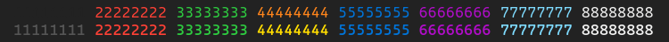

# hyperterm-chromodynamics-theme
Theme for Hyper.is based on https://github.com/MagicStack/Chromodynamics

## Preview

## Install

Add `'hyperterm-chromodynamics-theme'` to the plugins list in your `.hyper.js` config file.

## Credits

 - [MagicStack/Chromodynamics](https://github.com/MagicStack/Chromodynamics)
 - [ryanseys/hyperterm-colors](https://github.com/ryanseys/hyperterm-colors)
 - [stark/Color-Scripts](https://github.com/stark/Color-Scripts)
